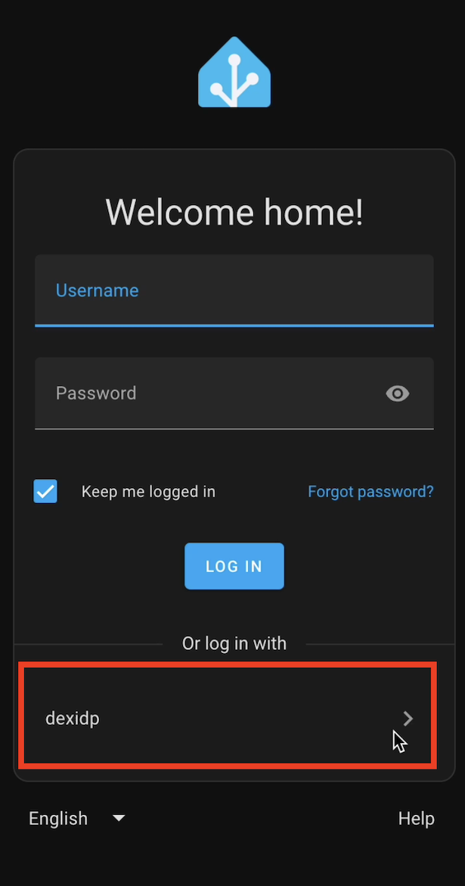

# home-assistant-openid-auth-provider

A Home Assistant Authentication Provider that can use Open ID

This software is an unofficial custom component for Home Assistant. It is not developed, endorsed, or affiliated with the Home Assistant project. Use this software at your own risk.

While efforts have been made to ensure the security and functionality of this software, it may introduce vulnerabilities, compatibility issues, or unexpected behavior. By installing and using this software, you accept full responsibility for any outcomes or consequences.

If you have concerns about security, performance, or compatibility, please consider reviewing the code before installation and ensure it meets your standards. This software is provided "as is," without warranty of any kind.

## Pre-requisites

You'll need an existing IDP set up. Here is an example setup for testing out [OpenID Connect with DexIDP](https://gist.github.com/bo0tzz/9531150b6aef0aafef5f739f7e903875).

You'll need to create a new `Client ID` and `Client Secret` for Home Assistant and record those for use during setup.

The `username` of the user in the IDP needs to match the username of a Home Assistant user you've created.

## Configuration

1. Install this custom component using HACS
1. Configure the _OpenID Auth Provider_ integration
1. Pick a name, set the URL for the _IDP_, and set the _Client ID_ and _Client Secret_
1. At the bottom of the configuration flow is a list of _Emails_ or _Subjects_ which are allowed to login. You can add users from the IDP to the allow list.

## Usage

1. The login page should now show an additional login option to use the IDP



## Development

1. Prepare virtual environment

   ```bash
   $ uv venv
   $ source .venv/bin/activate
   $ uv pip install -r requirements_dev.txt
   ```

1. Run tests

   ```bash
   $ py.test
   ```

1. Prepare Home Assistant environment

   ```bash
   $ export PYTHONPATH="${PYTHONPATH}:${PWD}"  # Allows loading custom_components
   $ hass --script ensure_config -c config
   ```

1. Run Home Assistant

   ```bash
   $ hass -c config
   ```
